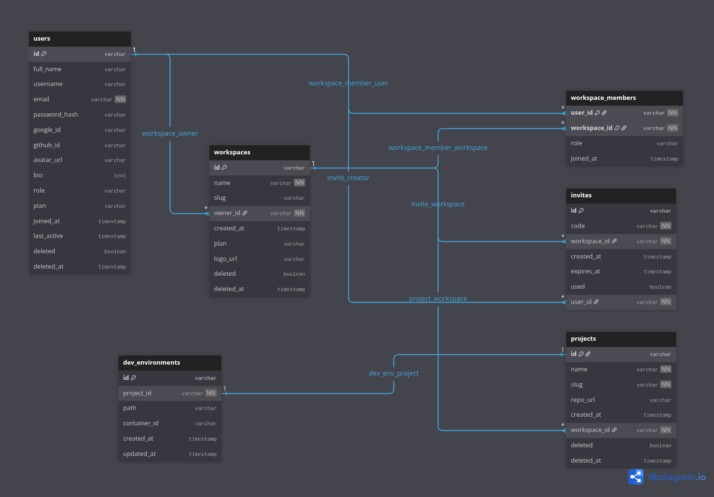

# CodeTogether

<div align="center">


**A collaborative development platform for teams**

[](https://opensource.org/licenses/MIT)
[](https://github.com/username/codetogether)
[](https://github.com/username/codetogether/releases)
[](CONTRIBUTING.md)

[Features](#features) • [Quick Start](#quick-start) • [Documentation](#documentation) • [Contributing](#contributing) • [Support](#support)

</div>

---

## 🚀 Overview

CodeTogether is a comprehensive collaborative development platform that brings teams together to build software efficiently. Combining containerized development environments, project management tools, and workspace organization, CodeTogether streamlines the entire development workflow from ideation to deployment.

### Why CodeTogether?

- **🔧 Containerized Development**: Consistent, isolated development environments for every project
- **📊 Visual Project Management**: Kanban boards for tracking tasks and project progress  
- **👥 Team Collaboration**: Organized workspaces with member management and role-based access
- **⚡ Quick Setup**: Get your team coding together in minutes, not hours
- **🌐 Cloud-Native**: Built for modern distributed teams

---

## ✨ Features

### 🏢 Workspaces
- Create and manage team workspaces
- Invite members with role-based permissions (Admin, Developer, Viewer)


### 📁 Projects
- Unlimited projects per workspace
- Project templates and boilerplates


### 🐳 Containerized IDE (DevEnv)
- Pre-configured development environments
- Support for 20+ programming languages and frameworks
- Integrated terminal and debugging tools
- Custom Dockerfile support
  
---

## 🚀 Quick Start

### Prerequisites

- Docker & Docker Compose
- Node.js 18+ (for local development)
- Git

### Installation

1. **Clone the repository**
   ```bash
   git clone https://github.com/username/codetogether.git
   cd codetogether
   ```

2. **Set up environment variables**
   ```bash
   cp .env.example .env
   # Edit .env with your configuration
   ```

3. **Start with Docker Compose**
   ```bash
   docker-compose up -d
   ```

4. **Access the platform**
   - Web Interface: `http://localhost:3000`
   - API Documentation: `http://localhost:3000/api/docs` (not completed)

### First Steps

1. **Create your account** at `http://localhost:3000/api/auth/register`
2. **Create a workspace** for your team
3. **Invite team members** via  workspace invite links
4. **Create your first project** and initialize a development environment
5. **Set up your Kanban board** and start managing tasks

---

## 🏗️ Architecture


---

## 🛠️ Development

### Local Development Setup

1. **Install dependencies**
   ```bash
   npm install
   cd src
   ```

2. **Start development servers**
   ```bash
   npm start
   ```

3. **Run tests**
   ```bash
   npm run test
   
   ```

### Technology Stack


**Backend**
- Node.js with Express
- PostgreSQL for primary database
- Docker for containerization

**DevEnv**
- Kubernetes for orchestration
- Code-server (theia in browser)


---


## 📄 License

This project is licensed under the MIT License - see the [LICENSE](LICENSE) file for details.

---


**[⬆ Back to top](#codetogether)**

Made with ❤️ by the Ahmed

</div>
